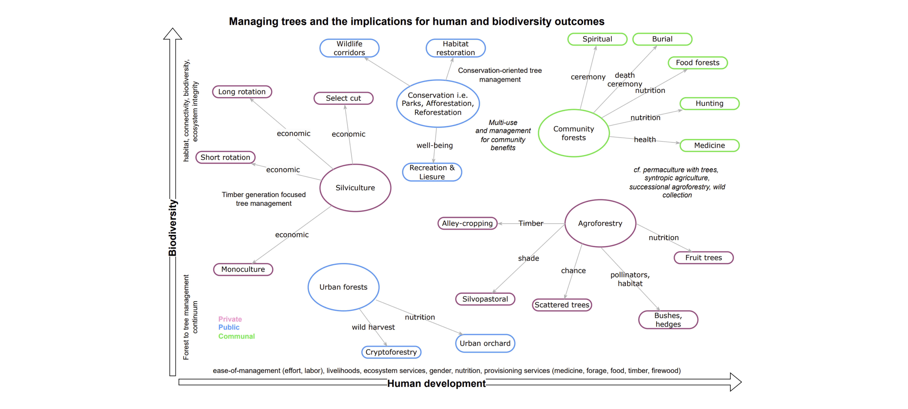
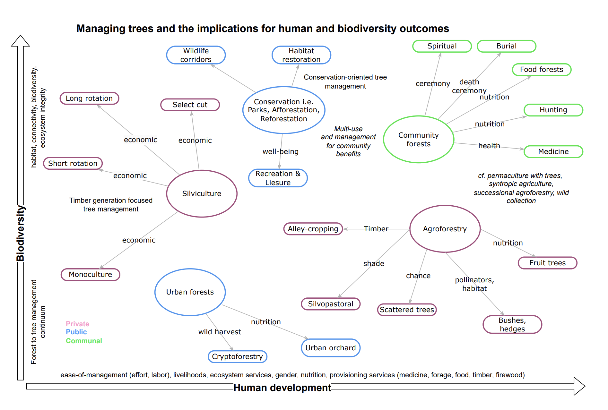

# The Global Challenge & The Untapped Opportunity

.pull-left[
### **The Pressure on Forests**

- 31% of global land is forested
- Crucial for biodiversity conservation, carbon sequestration, and ecosystem services
- Rising demand threatens these systems:
  - Timber
  - Fuelwood  
  - Agricultural land
]

.pull-right[
### **The Untapped Opportunity**

**Ethnoforestry**

- Integration of **Traditional Ecological Knowledge (TEK)**
- Bridges ancestral wisdom with modern science
- Scalable, inclusive pathway for sustainable development

]

---
# Conceptual - Human and Biodiversity Outcomes
.center[
 
]

---

# Our Research Approach & Conceptual Model

.pull-left[
### **Research Objective**

Systematically explore how ethnoforestry contributes to sustainable and productive land management.

### **Methodology**

1. **Systematic Literature Review**
   - Keywords: "ethnoforestry," "TEK," "biodiversity," "development"
   - Databases: Web of Science, Scopus
   - Remove erroneous papers
   - Annotate 7000+ papers
   - Create a Term-Document Matrix (TDM)
]


.pull-right[
### **Conceptual Model**



Shows how **Tree Management** informed by TEK drives outcomes for both **Livelihoods** and **Ecosystem Services**.

]

---
# Outcomes - Evidence Base

.pull-left[
### ** Provides data-driven foundation for integrating TEK into policy and practice ** 
### Shows strong positive links between:
- Ethnoforestry practices
- Biodiversity outcomes
- Human development indicators
]

.pull-right[
### ** Association Plot **

n = 7426 papers
]

---
# Outcomes - Association Plot
.center[

]

---

# Key Finding 1: Enhanced Biodiversity & Ecosystem Services

## **Key Results**

.pull-left[

**Increased Biodiversity**
  - Greater species richness
  - Enhanced habitat complexity

**Improved Ecosystem Services**
  - Water regulation
  - Soil health
  - Pollination services

**Transforms degraded lands into ecologically functional systems**

]

.pull-right[
**Socio-Economic Benefits**
- Income, Diversified streams of income
- Poverty Alleviation
- Equity and Gender equality

**Enhanced Carbon Sequestration**
  - Sustainable secondary forest use
  - Maintained carbon stocks
  
]

---
# Key Finding 2: Strengthened Livelihoods & Social Equity

.pull-left[
### **Key Enablers for Success**

- **Secure Land Tenure**
  - Fundamental for long-term investment

- **Participatory Governance**
  - Community involvement in decision-making

- **Capacity-Building Programs**
  - Knowledge transfer and skill development

- **Market Access**
  - Value chains for ethnoforestry products
]


.pull-right[
### **Solutions for Scaling**

- **Land Tenure Security**
  - Equitable land rights frameworks

- **Market Development**
  - Value chains for sustainable products

- **Supportive Policies**
  - Incentives for sustainable management
  - Community empowerment

- **Knowledge Integration**
  - Respectful TEK-science partnerships
]

---
# Next Steps & Future Research

.pull-left[
### **Research Agenda**

1. **Enhanced Modeling**
   - Bayesian framework integration
   - Predictive scenario development

2. **Pilot Interventions**
   - Co-development with communities
   - Testing in priority regions

3. **Interdisciplinary Collaboration**
   - Ecologists
   - Anthropologists
   - Economists
]

.pull-right[
### **Priority Regions**


**Focus Areas:**
- Brazil
- Nepal  
- Indonesia

**Context-sensitive management plans**
]

---

# Open Science & Invitation to Collaborate

.pull-left[
### **Open Science Commitment**

```{r echo=FALSE}
repo_info <- data.frame(
  Platform = "GitHub",
  Content = "All data, scripts, literature review",
  Access = "Open Access"
)
knitr::kable(repo_info, col.names = c("", "", ""))
```

**Repository:**  
[https://github.com/CWWhitney/ethnoforestry_agroforestry](https://github.com/CWWhitney/ethnoforestry_agroforestry)

]

.pull-right[
### **Invitation to Collaborate**

**We invite you to:**
- Explore the data
- Build upon our work
- Collaborate with us

**Let's work together to scale ethnoforestry practices globally**
]

---

class: center, middle, inverse

# Thank You!

### Questions?

**Contact:** Cory.Whitney@uni-bonn.de  
**Abstract ID:** 383

We acknowledge the vital role of traditional knowledge holders worldwide.

<br>

**#WCA6 #Agroforestry2025 #Ethnoforestry #TEK**